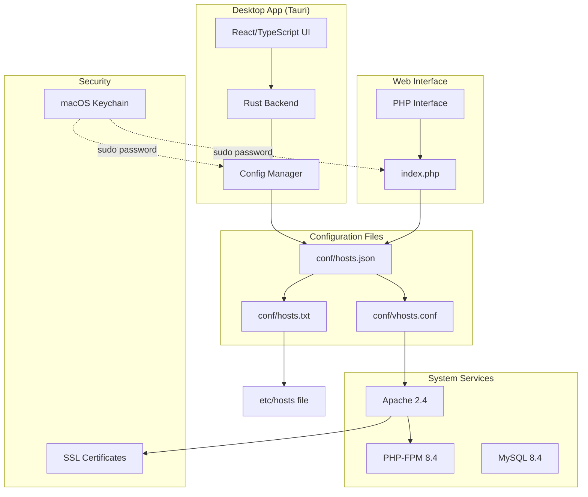
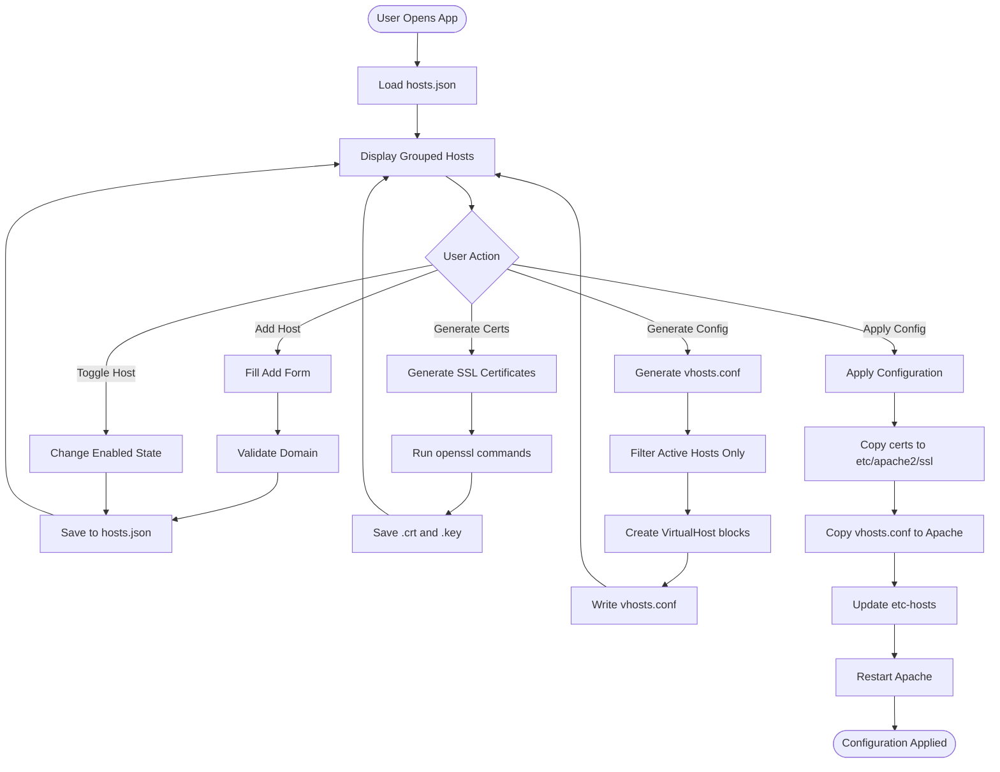
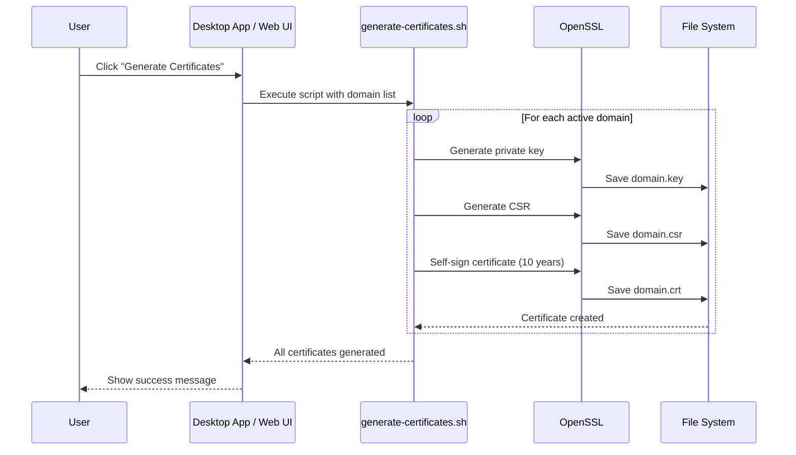
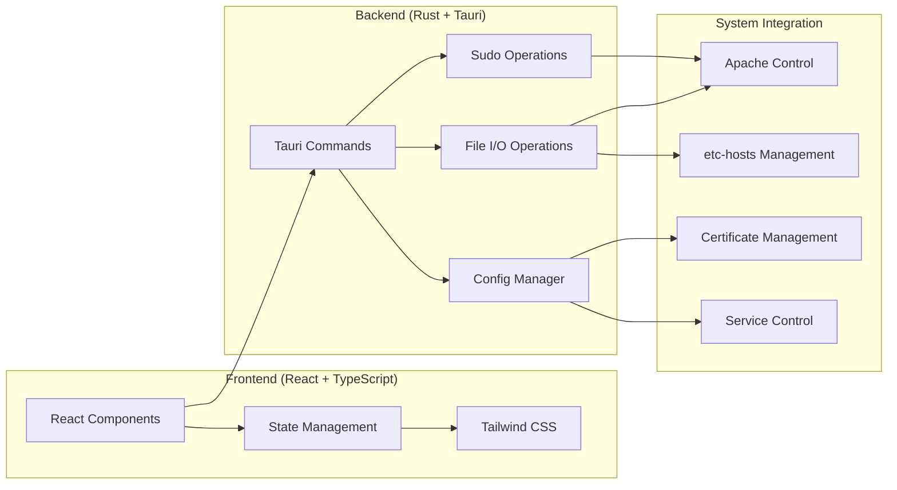
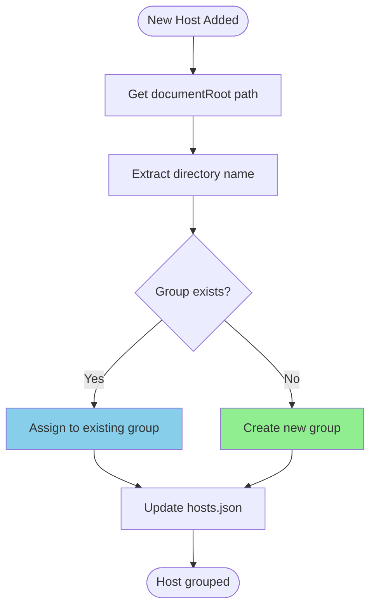
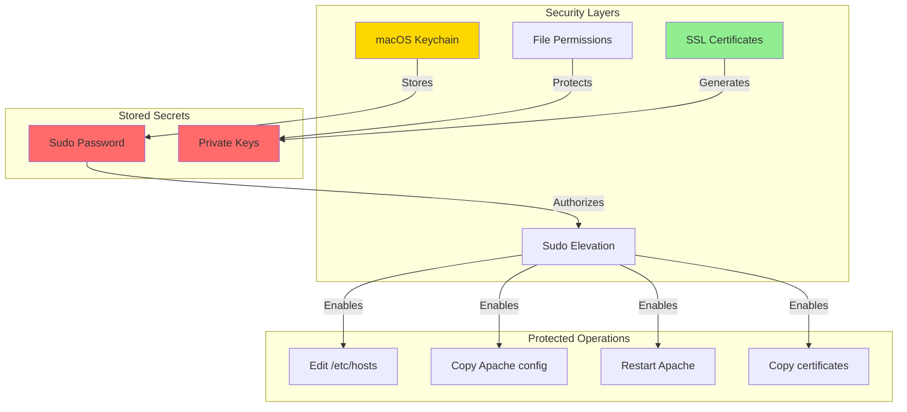
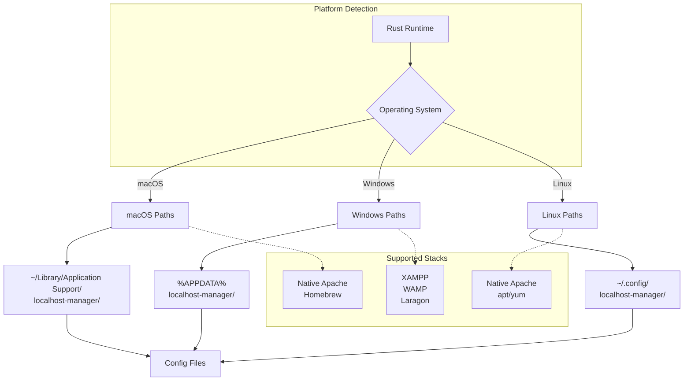

# Localhost Manager - Architecture Diagrams

## System Architecture

## Configuration Flow

## Certificate Generation Process

## Desktop App Structure

## Group Detection Logic

## Security Model

## Cross-Platform Support

